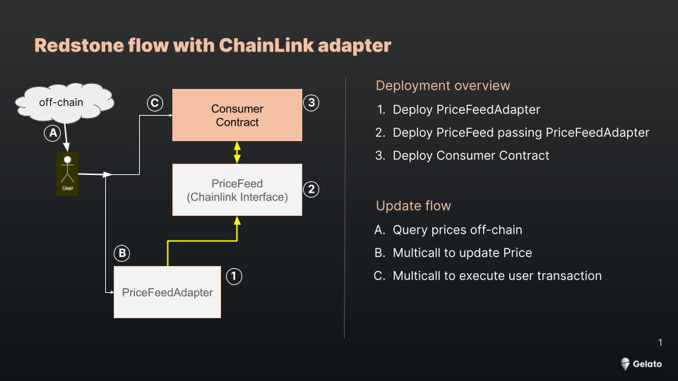

# Gelato Raas & Redstone
This simple React app showcases how to use Redstone on a Gelato Raas Rollup, the example is on Unreal
We will query the Gold(XAU) price every second and when the user set an order we will update the price on-chain and the consumer contract, the [SimplePriceFeedConsumer](https://unreal.blockscout.com/address/0x780AdF749BB8888c9FF7c5660DD50eA69080e753?tab=contract)

**PriceFeed Contracts**

[PriceFeedXAU Proxy](https://unreal.blockscout.com/address/0xD35c5551F3f63FF2992754db33165b11E81dAA73?tab=contract)

[PriceFeedAdapterXAU Proxy](https://unreal.blockscout.com/address/0x2FFC7f9A8147117C980F42017db09B1A2cE1d501?tab=contract)

The flow will be:

 


## Web3 App
The application is live on
[https://gelato-raas-redstone.web.app](https://gelato-raas-redstone.web.app)


 ## Code snippets

 ### Querying Price
```typescript
    const dataPackagesResponse = await sdk.requestDataPackages({
          dataServiceId: "redstone-main-demo",
          uniqueSignersCount: 1,
          dataFeeds: ["XAU"],
          urls: ["https://oracle-gateway-1.b.redstone.finance"],
        });

        const { dataPackage } = dataPackagesResponse["XAU"]![0];

        const parsedPrice = parsePrice(dataPackage.dataPoints[0].value);
```

### Updating price and execute consumer transaction

```typescript
 const wrapper = new DataPackagesWrapper(price.dataPackagesResponse!);
      const redstonePayload = await wrapper.getRedstonePayloadForManualUsage(
        simplePriceFeedConsumer!
      );

      const { dataPackage } = price.dataPackagesResponse!["XAU"]![0];
      // You can read more about redstone payload structure here: https://docs.redstone.finance/docs/smart-contract-devs/how-it-works#data-packing-off-chain-data-encoding
      console.log(`Redstone payload: ${redstonePayload}`);
      const redstonePayloadWithoutZeroEx = redstonePayload.replaceAll("0x", "");

      // Prepare the call with the prices update
      const callWithPriceUpdateInAdapter = {
        target: priceFeedAdapter!.address,
        callData:
          priceFeedAdapter!.interface.encodeFunctionData(
            "updateDataFeedsValues",
            [dataPackage.timestampMilliseconds]
          ) + redstonePayloadWithoutZeroEx,
      };

      // Prepare the actual call on the consumer contract (with the business logic)
      let readyPrice = +(price.price * 100000000).toFixed(0);
      const callOnConsumerContract = {
        target: simplePriceFeedConsumer!.address,
        callData: simplePriceFeedConsumer!.interface.encodeFunctionData(
          "doSomethingWithPrice",
          [readyPrice]
        ),
      };
      const signer = await provider?.getSigner();

      const multicall = new ethers.Contract(
        MulticallJson.address,
        MulticallJson.abi,
        signer
      );

      const multicallTx = await multicall.aggregate([
        callWithPriceUpdateInAdapter,
        callOnConsumerContract,
      ]);
      await multicallTx.wait();
```
